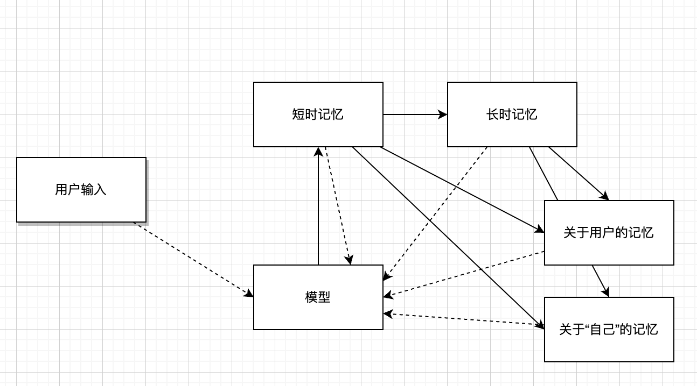
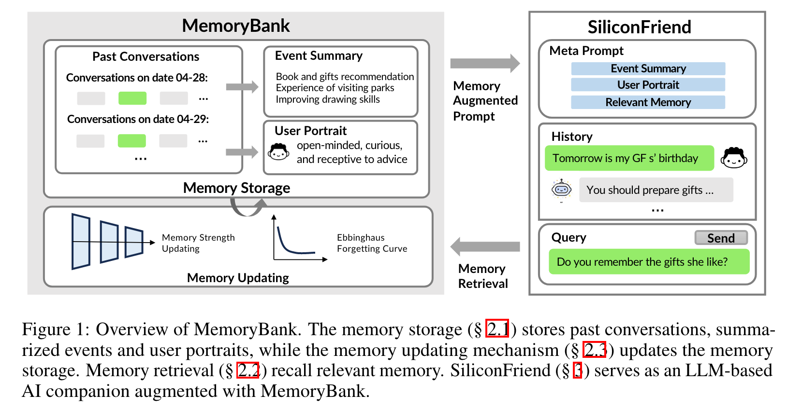
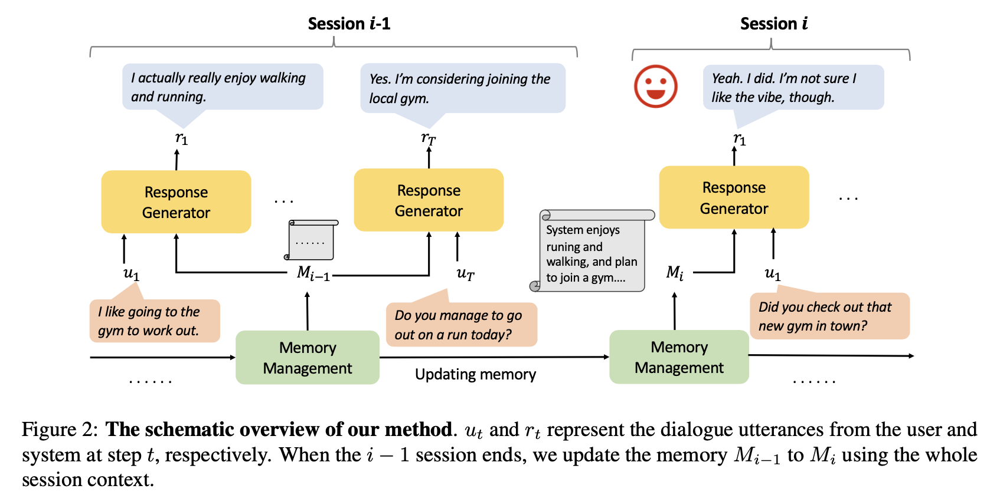
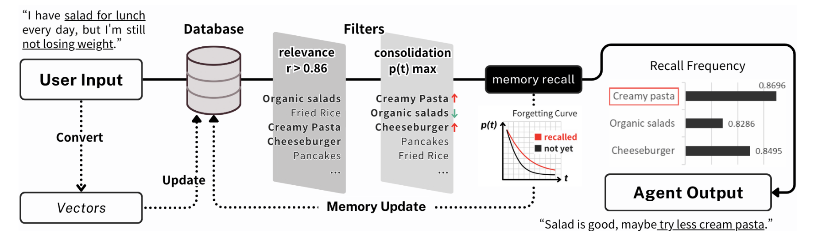
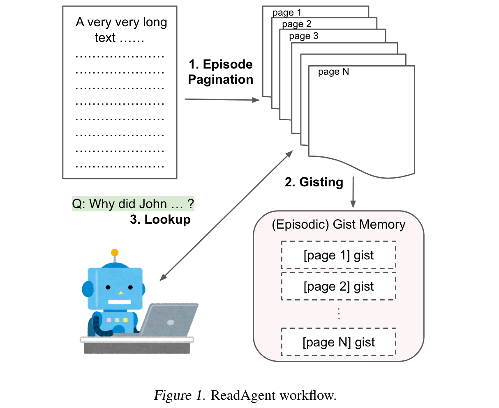
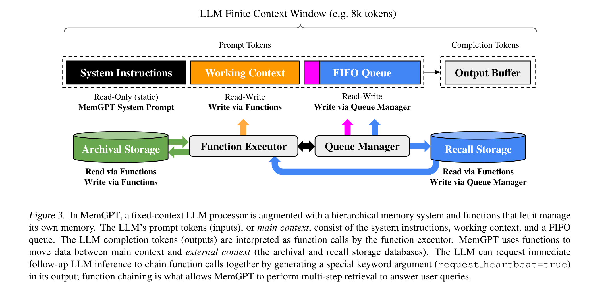

# Digital Life / 数字生命

创造一个可以带走的"数字生命". 本项目同时支持 Web 和桌面端, 两端共享除特定 API 外的所有代码. 开发环境要求包括 `Rust` (仅桌面端需要)、`Node.js`、`Bun` (可通过 `npm install -g bun` 安装)

如果您想快速体验本项目, 请访问 <https://being.leafyee.xyz>, 并在本地运行 `ollama` 服务 (见[2 开发和部署](#2-开发和部署))

| 记忆模型 (暂定) | 示意图 |
| :---: | :---: |
|  |  |

- [Digital Life / 数字生命](#digital-life--数字生命)
  - [1 项目说明](#1-项目说明)
  - [2 开发和部署](#2-开发和部署)
    - [2.1 环境变量](#21-环境变量)
    - [2.2 桌面端](#22-桌面端)
    - [2.3 Web 端](#23-web-端)
  - [3 待办事项](#3-待办事项)
  - [4 长时记忆](#4-长时记忆)
    - [4.1 现有做法](#41-现有做法)
    - [4.2 本项目设计](#42-本项目设计)
  - [5 Live2d 模型版权声明](#5-live2d-模型版权声明)
  - [6 参考文献](#6-参考文献)

## 1 项目说明

- **愿景**: 如流浪地球2 (<https://digitallife.ac.cn>) 那样, 创造一个可以带走的"数字生命"; 交互效果类似于: [【【Neuro】吊打GPT！点击就看AI女王绝杀ChatGPT】](https://www.bilibili.com/video/BV1Db1WYgESn/?share_source=copy_web&vd_source=f73d7b1cc6b3e028bd1d6a660f91c4f1)
- **关于长时记忆**: 见[4 长时记忆](#4-长时记忆)
- **本项目的优势和特点**: 与同类项目如 <https://github.com/t41372/Open-LLM-VTuber> 的区别在于, 本项目使用更为简单和灵活, 同时支持 Web 和桌面版本, 用户无需安装任何多余的软件; 同时, 本项目的 API 设计也比较灵活, 可以便捷地拓展多种后端实现; 最后如上所述, 可解释性的记忆能提供更多可能
- **关于基础模型**: 目前默认用的是 `qwen2.5:7b` (本地)、`qwen1.5:13b-awq` (Web - API)、`qwen2.5:0.5b` (Web Transformers.js), 后期可能会使用 <https://github.com/SmartFlowAI/EmoLLM> 或其他模型
- **关于 `live2d`**: 目前使用 <https://github.com/oh-my-live2d/oh-my-live2d>, 也尝试过 <https://github.com/guansss/pixi-live2d-display>. 但是两者都无法完全满足需求, 后期可能会 `fork` 之后按需修改
- **关于语音生成**: 目前用的是 `Web Speech API`, 但效果感觉一般, 默认关闭. 桌面端还实验性地支持 <https://github.com/SWivid/F5-TTS> (使用 <https://github.com/jianchang512/f5-tts-api>), 效果很不错, 但对配置要求较高, 且对 Mac 不友好. 后期可能会尝试其他 `TTS` 技术
- **关于语音输入**: 目前用的也是 `Web Speech API`, 效果不错, 默认关闭. 后期也会探索使用其他 `STT` 技术、添加实时对话功能
- **外部世界信息**: 未来会加入可选的天气、新闻、股票等信息给 AI (通过相关平台的 API 在线获取)、通过 <https://github.com/microsoft/markitdown> 支持文件输入 (把 `Python` 作为 `Tauri` 的 `sidecar` 运行)

## 2 开发和部署

本项目的 LLM 推理通过 `ollama` 实现. 请提前安装 `ollama`, 运行 `ollama pull qwen2.5:7b` (或通过环境变量指定的其他模型) 下载模型, 并启动 `ollama` 服务

在 Web 端时, 您可能需要手动设置 `ollama` 的 `CORS` 策略以避免请求被浏览器拦截: 首先设置本地的 `OLLAMA_ORIGINS` 环境变量为 `"*"` 或 `"being.leafyee.xyz"`、在终端中运行 `echo $OLLAMA_ORIGINS` 确认设置成功、在终端中运行 `ollama serve` 启动服务 (即使进行了上述设置, 仍然可能会在 `Safari` 中遇到 `CORS` 问题, 请尝试使用 `Chrome` 或其他浏览器)

### 2.1 环境变量

以下环境变量都具有默认值, 正常情况下无需手动设置

| 环境变量名 | 默认值 | 说明 |
| :---: | :---: | :---: |
| `VITE_OLLAMA_SERVER_URL` | `'http://127.0.0.1:11434'` | `ollama` 服务地址 |
| `VITE_OLLAMA_MODEL_NAME` | `'qwen2.5:7b'` | `ollama` 使用的模型 |
| `VITE_OLLAMA_MAX_TOKENS` | `100000` | 上述模型的最大 `token` 数 |
| `VITE_OLLAMA_LABEL_NAME` | `'Ollama - <model_name>'` | 前端显示的模型名称 |
| `VITE_F5_TTS_SERVER_URL` | `'http://127.0.0.1:5010/api'` | [本地 `F5-TTS` 服务地址](https://github.com/jianchang512/f5-tts-api) |

### 2.2 桌面端

```bash
# 克隆项目
git clone https://github.com/LeafYeeXYZ/DigitalLife.git
cd DigitalLife
# 安装依赖
bun install
# 运行
bun d:tauri
# 构建
bun b:tauri
```

### 2.3 Web 端

请注意 Web 端构建后的输出目录为 `/dist-web` 而非 `/dist`

```bash
# 克隆项目
git clone https://github.com/LeafYeeXYZ/DigitalLife.git
cd DigitalLife
# 安装依赖
bun install
# 运行
bun d:web
# 构建
bun b:web
```

## 3 待办事项

- [ ] 软件图标
- [ ] 黑暗模式, 包括 `index.html`
- [ ] 记忆功能
- [ ] 连续对话功能

## 4 长时记忆

### 4.1 现有做法

- **MemoryBank: Enhancing Large Language Models with Long-Term Memory** (Zhong et al., 2023): 通过记忆库 (MemoryBank) 实现长时记忆. 具体来讲, 将用户的每批对话生成摘要并按时间顺序存储在记忆库中, 过程中更新用户画像. 对话时, 将用户输入用向量搜索的方式与记忆库中的摘要进行匹配, 将提取到的摘要、用户画像、当前对话上下文输入给模型; 参考艾宾浩斯遗忘曲线, 按照时间和重复次数来确定记忆遗忘率 
- **Recursively Summarizing Enables Long-Term Dialogue Memory in Large Language Models** (Wang et al., 2024): 通过递归生成摘要/记忆来实现长时记忆. 具体来讲, LLMs首先记忆小的对话上下文, 然后递归地使用之前的记忆和后续的上下文来生成新的记忆 
- **"My agent understands me better": Integrating Dynamic Human-like Memory Recall and Consolidation in LLM-Based Agents** (Hou et al., 2024): 通过与人类记忆类似的"线索回忆"和"记忆巩固"机制实现长时记忆. 具体来讲, 将用户输入向量化, 并存入/更新数据库 (新增/加强记忆), 随后在数据库中进行相关性查询, 根据相关性、记忆巩固强度、记忆存储的时间三个因子, 找到能回忆起的记忆并发送给模型 
- **A Human-Inspired Reading Agent with Gist Memory of Very Long Contexts** (Lee et al., 2024): 并非直接的长时记忆方案, 而是一个处理长文本的方法. 具体来讲, 将长文本分为多个片段, 每个片段生成一个摘要并将其与原文关联, 根据任务和所有摘要决定要查询哪些片段; 以上过程均由模型自主完成 (原文给出了每步的提示词). 最后将得到的精简信息输入给模型 
- **MemGPT: Towards LLMs as Operating Systems** (Packer et al., 2024): 借鉴虚拟内存的思想, 让模型通过函数调用读取外部记忆. 具体来讲, 将模型的上下文分为主上下文 (包含系统提示词、记忆调用结果、当前对话上下文) 和外部上下文 (记忆); 每次对话时, 模型自主进行函数调用, 读写外部上下文, 更新主上下文的记忆调用结果, 并通过更新后的主上下文进行推理  <!-- 这个的“内存压力”和我当前的“记忆负荷”设计类似 -->

### 4.2 本项目设计

- 本项目期望能够"创造一个可以带走的'数字生命'", 即能在大多数笔记本等轻量级设备中运行. 因此, 我希望它的长时记忆系统能够具有**较低的计算负载**
- 我认为人工智能将是人类文明的下一形态, 未来的人类将可以通过脑机接口等技术与 AI 深度集成, 乃至最后融合. 因此, 对未来的"数字生命", 我仍为它应当是**源于人类而在某些方面超越人类**的. 因此, 它的记忆机制将参考人脑设计, 但在记忆的遗忘等方面可以有所差异 (即可以有比人类更持久的记忆)
- 我希望将 AI 的"自我概念"和"对用户的概念" (类似于 MemoryBank (Zhong et al., 2023) 中的用户画像) 单独存储, 以提升 AI 回答的一致性和让 AI **拥有"灵魂" (自我概念) 和"爱" (对用户的概念)**

基于以上考虑, 本项目的长时记忆设计为: 让当前上下文中包含"自我概念"、"对用户的概念"、当前上下文 ("短时记忆"), 并让模型按需提取总结后的记忆 ("长时记忆"); 提取的过程可能是如 MemoryBank (Zhong et al., 2023) 中的向量搜索或用 MemGPT (Packer et al., 2024) / Lee et al. (2024) 的方法让模型自我决策. 每次总结时递归更新"自我概念"和"对用户的概念"

## 5 Live2d 模型版权声明

本项目内的所有模型皆为在 B 站发布的免费模型, 请勿直接复制使用, 如有需要可至原地址获取

## 6 参考文献

- Hou, Y., Tamoto, H., & Miyashita, H. (2024). “My agent understands me better”: Integrating Dynamic Human-like Memory Recall and Consolidation in LLM-Based Agents. Extended Abstracts of the CHI Conference on Human Factors in Computing Systems, 1–7. https://doi.org/10.1145/3613905.3650839
- Lee, K.-H., Chen, X., Furuta, H., Canny, J., & Fischer, I. (2024). A Human-Inspired Reading Agent with Gist Memory of Very Long Contexts (arXiv:2402.09727). arXiv. https://doi.org/10.48550/arXiv.2402.09727
- Packer, C., Wooders, S., Lin, K., Fang, V., Patil, S. G., Stoica, I., & Gonzalez, J. E. (2024). MemGPT: Towards LLMs as Operating Systems (arXiv:2310.08560). arXiv. https://doi.org/10.48550/arXiv.2310.08560
- Wang, Q., Ding, L., Cao, Y., Tian, Z., Wang, S., Tao, D., & Guo, L. (2024). Recursively Summarizing Enables Long-Term Dialogue Memory in Large Language Models (arXiv:2308.15022). arXiv. https://doi.org/10.48550/arXiv.2308.15022
- Zhong, W., Guo, L., Gao, Q., Ye, H., & Wang, Y. (2023). MemoryBank: Enhancing Large Language Models with Long-Term Memory (arXiv:2305.10250). arXiv. https://doi.org/10.48550/arXiv.2305.10250
