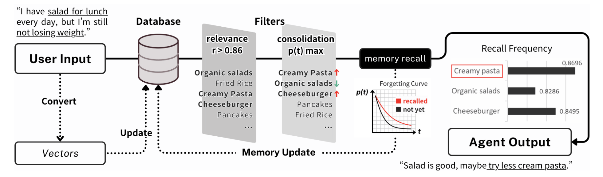
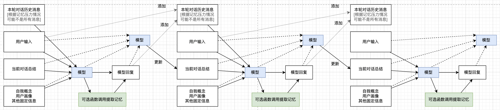
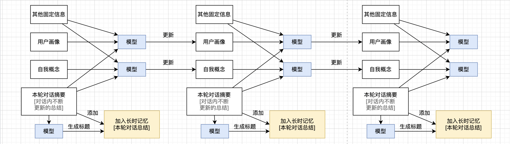

# Digital Life / 数字生命

创造一个有自我概念、长时记忆的"数字生命". 同时支持 Web 和桌面端、支持多种推理、TTS、STT 服务

如果您想快速体验本项目, 可在 <https://deepseek.com> 等平台注册一个免费账号, 获取 `API Key`, 并访问 <https://being.leafyee.xyz>, 在应用内设置 `Endpoint`、`API Key`、`Model Name` 即可使用 (也可直接本地运行 `ollama`, 见[2 开发和部署](#2-开发和部署))


- [Digital Life / 数字生命](#digital-life--数字生命)
  - [1 项目说明](#1-项目说明)
  - [2 开发和部署](#2-开发和部署)
    - [2.1 桌面端](#21-桌面端)
    - [2.2 Web 端](#22-web-端)
    - [2.3 环境变量](#23-环境变量)
  - [3 待办事项](#3-待办事项)
  - [4 长时记忆](#4-长时记忆)
    - [4.1 现有做法](#41-现有做法)
    - [4.2 本项目设计](#42-本项目设计)
  - [5 Live2d 模型版权声明](#5-live2d-模型版权声明)
  - [6 参考文献](#6-参考文献)

> **临时引用信息**: `叶一杉. (2025). DigitalLife: 具有长时记忆、自我概念、听说读写能力的"数字生命". https://github.com/LeafYeeXYZ/DigitalLife`

## 1 项目说明

本项目希望如*流浪地球2* (<https://digitallife.ac.cn>) 那样, 创造一个有自己的情感、记忆的"数字生命". 并通过 `Live2d` 技术, 使其有更好的交互效果 (如[Neuro Sama](https://www.bilibili.com/video/BV1Db1WYgESn/?share_source=copy_web&vd_source=f73d7b1cc6b3e028bd1d6a660f91c4f1)). 相比[同类项目](https://github.com/t41372/Open-LLM-VTuber), 本项目使用更为简单 (直接在 <https://being.leafyee.xyz> 即可体验), 且记忆功能更为强大

关于长时记忆, 本项目参考了多篇论文, 并设计了一个独特的记忆系统. 详见[4 长时记忆](#4-长时记忆)

| 模块 | 可选项 | 说明 |
| :---: | :---: | :---: |
| 推理模型 | 任意兼容 `OpenAI` 规范的服务 | 默认使用 `ollama`, 可在应用内修改 `Endpoint`、`API Key`、`Model Name` 等 |
| 嵌入模型 | `jina-embeddings-v3` | 用于记忆提取, 需在应用内设置 `Endpoint` 和/或 `API Key` |
| 语音生成 `TTS` | [`F5 TTS` 服务](https://github.com/jianchang512/f5-tts-api) | 默认服务地址为 `'http://127.0.0.1:5010/api'`, 可在应用内修改 |
| | [`Fish Speech` 服务](https://speech.fish.audio/zh/inference/#http-api) | 默认服务地址为 `'http://127.0.0.1:8080'`, 可在应用内修改 |
| 语音输入 `STT` | [Web Speech API](https://developer.mozilla.org/en-US/docs/Web/API/Web_Speech_API) | 使用浏览器内置的 `STT` 功能 |
| `Live2d` | - | 使用 <https://github.com/oh-my-live2d/oh-my-live2d> 项目 |
| 其他 | 天气信息 | 默认关闭, 可在应用内设置[和风天气 API Key](https://dev.qweather.com/)开启 |
| | 时间信息 | 模型可获知当前设备时间、对话开始时间、首次相遇时间 |
| | 图片输入 | 🚧 WIP |
| | 图片输出 | 🚧 WIP |
| | 文件输入 | 🚧 WIP, 可能会使用 <https://github.com/microsoft/markitdown> |
| 记忆云备份 | S3 | 在记忆备份界面填写相关信息即可使用 |

> `TTS` 和 `STT` 服务默认关闭, 可在应用内的设置中开启

## 2 开发和部署

本项目同时支持 Web 和桌面端, 所有设置均可在应用内完成, 无需修改代码

LLM 推理使用 `OpenAI SDK` 实现, 您可以使用任何兼容的服务, 如 `ollama`. 默认情况下, 本项目使用 `ollama` 服务和 `qwen2.5:7b` 模型, 请提前安装 `ollama`, 运行 `ollama pull qwen2.5:7b` 下载模型, 并启动 `ollama` 服务; 或应用内设置指定其他模型/服务

> 如果使用 `ollama`, 在 Web 端时, 您可能需要手动设置 `ollama` 的 `CORS` 策略以避免请求被浏览器拦截: 首先设置本地的 `OLLAMA_ORIGINS` 环境变量为 `"*"`、在终端中运行 `echo $OLLAMA_ORIGINS` 确认设置成功、在终端中运行 `ollama serve` 启动服务 (即使进行了上述设置, 仍然可能会在 `Safari` 中遇到 `CORS` 问题, 请尝试使用 `Chrome` 浏览器)

### 2.1 桌面端

```bash
# 克隆项目
git clone https://github.com/LeafYeeXYZ/DigitalLife.git
cd DigitalLife
# 安装依赖
bun install
# 运行
bun dev:tauri
# 构建
bun build:tauri
```

### 2.2 Web 端

请注意 Web 端构建后的输出目录为 `/dist-web` 而非 `/dist`

```bash
# 克隆项目
git clone https://github.com/LeafYeeXYZ/DigitalLife.git
cd DigitalLife
# 安装依赖
bun install
# 运行
bun dev:web
# 构建
bun build:web
```

### 2.3 环境变量

| 环境变量名 | 默认值 | 说明 |
| :---: | :---: | :---: |
| `VITE_DEBUG_COMPONENT` | `'off'` | 仅当设为 `'on'` 时, 会显示调试组件 |

## 3 待办事项

- [ ] 软件图标
- [ ] 黑暗模式, 包括 `index.html`
- 记忆功能
  - [x] 当前对话递归总结
  - [x] 保存为长时记忆
  - [ ] 可以自行提取记忆
  - [ ] 将记忆模块独立为一个 TypeScript 和 Python 包
- [ ] 自主行动和迭代

## 4 长时记忆

### 4.1 现有做法

- **MemoryBank: Enhancing Large Language Models with Long-Term Memory** (Zhong et al., 2023): 通过记忆库 (MemoryBank) 实现长时记忆. 具体来讲, 将用户的每批对话生成摘要并按时间顺序存储在记忆库中, 过程中更新用户画像. 对话时, 将用户输入用向量搜索的方式与记忆库中的摘要进行匹配, 将提取到的摘要、用户画像、当前对话上下文输入给模型; 参考艾宾浩斯遗忘曲线, 按照时间和重复次数来确定记忆遗忘率 
- **Recursively Summarizing Enables Long-Term Dialogue Memory in Large Language Models** (Wang et al., 2024): 通过递归生成摘要/记忆来实现长时记忆. 具体来讲, LLMs首先记忆小的对话上下文, 然后递归地使用之前的记忆和后续的上下文来生成新的记忆 
- **"My agent understands me better": Integrating Dynamic Human-like Memory Recall and Consolidation in LLM-Based Agents** (Hou et al., 2024): 通过与人类记忆类似的"线索回忆"和"记忆巩固"机制实现长时记忆. 具体来讲, 将用户输入向量化, 并存入/更新数据库 (新增/加强记忆), 随后在数据库中进行相关性查询, 根据相关性、记忆巩固强度、记忆存储的时间三个因子, 找到能回忆起的记忆并发送给模型 
- **A Human-Inspired Reading Agent with Gist Memory of Very Long Contexts** (Lee et al., 2024): 并非直接的长时记忆方案, 而是一个处理长文本的方法. 具体来讲, 将长文本分为多个片段, 每个片段生成一个摘要并将其与原文关联, 根据任务和所有摘要决定要查询哪些片段; 以上过程均由模型自主完成 (原文给出了每步的提示词). 最后将得到的精简信息输入给模型 
- **MemGPT: Towards LLMs as Operating Systems** (Packer et al., 2024): 借鉴虚拟内存的思想, 让模型通过函数调用读取外部记忆. 具体来讲, 将模型的上下文分为主上下文 (包含系统提示词、记忆调用结果、当前对话上下文) 和外部上下文 (记忆); 每次对话时, 模型自主进行函数调用, 读写外部上下文, 更新主上下文的记忆调用结果, 并通过更新后的主上下文进行推理  <!-- 这个的“内存压力”和我当前的“记忆负荷”设计类似 -->

### 4.2 本项目设计

作者认为人工智能将可能是人类文明的下一形态, 未来的人类将可以通过脑机接口等技术与 AI 深度集成, 乃至最后融合. 因此, 对未来的"数字生命", 我仍为它应当是**源于人类而在某些方面超越人类**的. 因此, 它的记忆机制将参考人脑设计, 但在记忆的遗忘等方面可以有所差异; 即可以有比人类更持久的记忆, 而不特意采用以前的做法中的遗忘机制. 同时, 作者希望将 AI 拥有"自我概念"和"用户画像" (类似于 MemoryBank (Zhong et al., 2023)), 从而提升 AI 在多轮对话间回答的一致性, 以及让 AI **拥有"灵魂" (通过自我概念) 和"爱" (通过用户画像)**

基于以上考虑, 本项目的记忆模型设计为: 让当前上下文中包含"自我概念"、"用户画像"、本轮对话内容 ("短时记忆")、递归生成的当日对话总结 (类似于 Wang et al., 2024)、以及其他固定和外部信息, 并让模型按需提取过往的"长时记忆"; 提取的方式是模型自主决策, 返回是否需要提取、提取的内容、提取的条数等信息; 通过将模型的描述与长时记忆进行向量距离计算, 找到最相关的记忆, 并将其输入给模型

"长时记忆"更新的时机为连续数小时 (当前默认为八小时) 无新增对话后, 或用户主动要求更新记忆时. 在更新记忆时, 也会递归更新"自我概念"和"用户画像"

| 一轮对话内的记忆更新 | 多轮对话间的记忆更新 |
| :---: | :---: |
|  |  |

## 5 Live2d 模型版权声明

本项目内的所有模型皆为在 B 站发布的免费模型, 请勿直接复制使用, 如有需要可至原地址获取

## 6 参考文献

- Hou, Y., Tamoto, H., & Miyashita, H. (2024). “My agent understands me better”: Integrating Dynamic Human-like Memory Recall and Consolidation in LLM-Based Agents. Extended Abstracts of the CHI Conference on Human Factors in Computing Systems, 1–7. https://doi.org/10.1145/3613905.3650839
- Lee, K.-H., Chen, X., Furuta, H., Canny, J., & Fischer, I. (2024). A Human-Inspired Reading Agent with Gist Memory of Very Long Contexts (arXiv:2402.09727). arXiv. https://doi.org/10.48550/arXiv.2402.09727
- Packer, C., Wooders, S., Lin, K., Fang, V., Patil, S. G., Stoica, I., & Gonzalez, J. E. (2024). MemGPT: Towards LLMs as Operating Systems (arXiv:2310.08560). arXiv. https://doi.org/10.48550/arXiv.2310.08560
- Wang, Q., Ding, L., Cao, Y., Tian, Z., Wang, S., Tao, D., & Guo, L. (2024). Recursively Summarizing Enables Long-Term Dialogue Memory in Large Language Models (arXiv:2308.15022). arXiv. https://doi.org/10.48550/arXiv.2308.15022
- Zhong, W., Guo, L., Gao, Q., Ye, H., & Wang, Y. (2023). MemoryBank: Enhancing Large Language Models with Long-Term Memory (arXiv:2305.10250). arXiv. https://doi.org/10.48550/arXiv.2305.10250
